# Decoding Neural Dynamics of Visual Perceptual Segmentation

[](https://www.python.org/downloads/)
[](https://pytorch.org)
[](LICENSE)

<p align="center">
  
</p>

> **MSc thesis** — Albert Einstein College of Medicine (Laboratory of Computational Biology)
> A deep learning architecture for gaze prediction that explicitly uses visual segmentation to model human attention.

---

## Overview

This repository contains the complete implementation of **DinoGaze-SPADE**, a probabilistic model for predicting human gaze patterns (scanpaths) on static images. The project studies how Vision Transformer features and explicit segmentation guidance change saliency and scanpath prediction.

### The Core Hypothesis

Most deep gaze models rely on an **implicit, feature-based** understanding of scenes. They lack an explicit representation of the scene's **compositional structure** — the objects and surfaces that are the primary units of human attention. This thesis tests whether explicitly injecting a scene's visual segmentation into the model improves gaze prediction, and finds that it does.

### Key results

- Improves over DeepGaze III on SALICON, MIT1003 spatial saliency, and MIT1003 scanpath prediction.
- **+15.6% Information Gain** vs DeepGaze III on SALICON (DinoGaze-SPADE).
- **+12.8% Information Gain** vs DeepGaze III on MIT1003 spatial saliency (DinoGaze ViT baseline).
- **+6.5%** on the MIT1003 sequential scanpath prediction task (DinoGaze-SPADE).
- **Semantic painting**: injects unsupervised segmentation masks into a ViT via spatially-adaptive normalization (SPADE).

---

## Visual Examples

### Dataset Samples

The model is trained on two complementary datasets: SALICON (large-scale pre-training) and MIT1003 (high-fidelity eye-tracking).

<p align="center">
  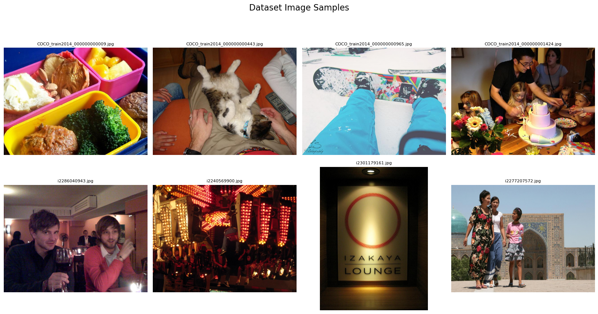
  <br>
  <em>Top: SALICON dataset with fixed 4:3 aspect ratio. Bottom: MIT1003 with variable aspect ratios.</em>
</p>

### Scanpath Prediction

The model predicts sequential eye movements (scanpaths) that closely match human viewing behavior.

<p align="center">
  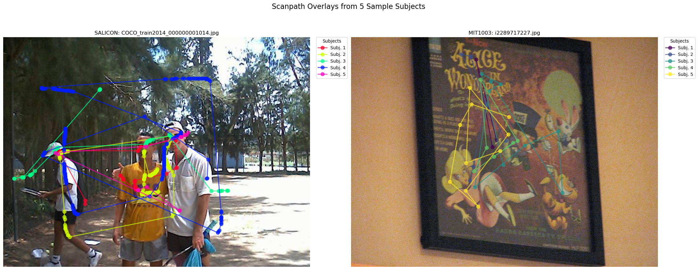
  <br>
  <em>Left: SALICON mouse-contingent pseudofixations. Right: MIT1003 true eye-tracking scanpaths showing detailed human viewing patterns.</em>
</p>

### Saliency Map Comparison

DinoGaze-SPADE produces cleaner, more semantically focused saliency maps compared to previous models.

<p align="center">
  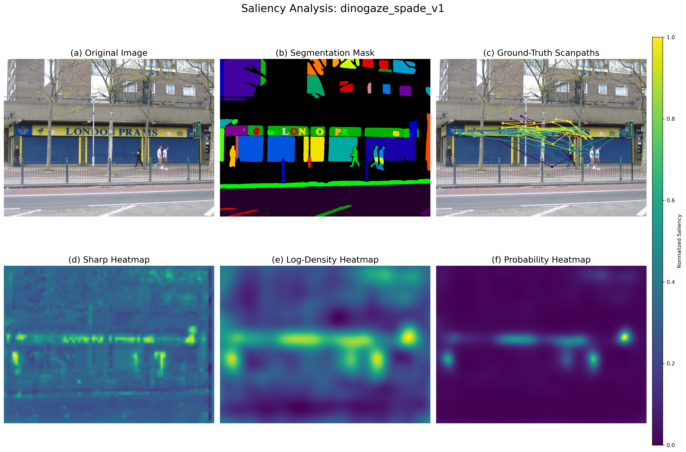
  <br>
  <em>DinoGaze-SPADE: Focuses cleanly on semantic objects (people, text, signs) while ignoring high-contrast background textures.</em>
</p>

<p align="center">
  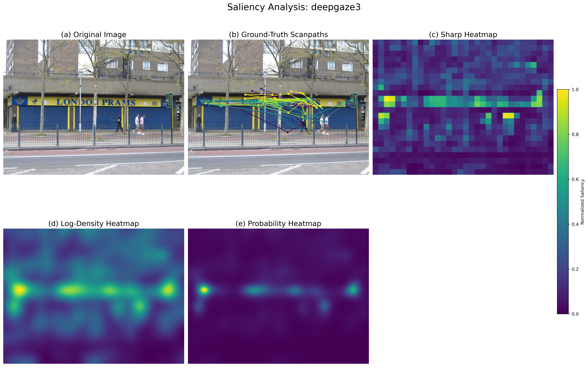
  <br>
  <em>DeepGaze III: Often highlights irrelevant high-contrast textures in the background.</em>
</p>

### Temporal Scanpath Prediction

Beyond static saliency, DinoGaze-SPADE excels at **sequential scanpath prediction** — predicting where a person will look next based on their viewing history.

<p align="center">
  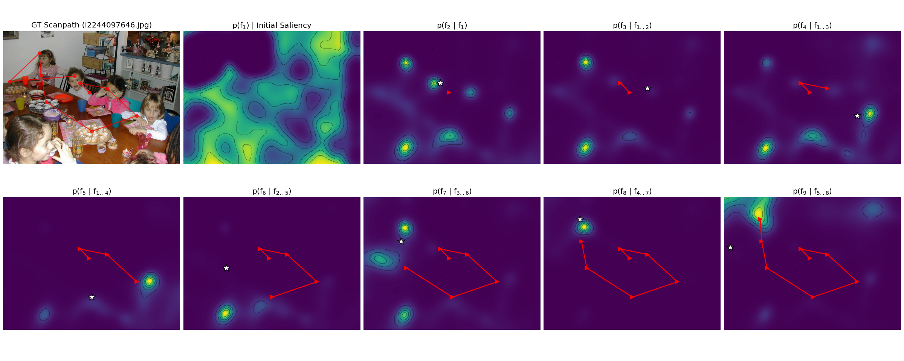
  <br>
  <em>Step-by-step scanpath prediction. Left: Full ground-truth scanpath. Right panels: Model predictions at each step (red arrows = history, white star = true next fixation, heatmap = predicted probability).</em>
</p>

<p align="center">
  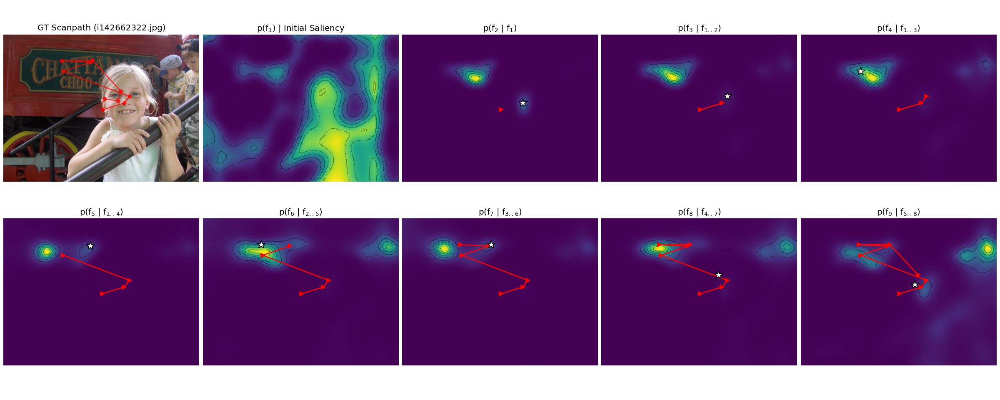
  <br>
  <em>The model correctly focuses probability mass on semantically relevant objects (faces, people) as the viewing history evolves.</em>
</p>

The model achieves **+6.5% improvement** over DeepGaze III on the challenging MIT1003 scanpath prediction task, demonstrating that explicit segmentation information helps model the temporal dynamics of human attention.

---

## Architecture and Innovations

### 1. Vision Transformer Backbone (DINOv2)

We replace the traditional CNN backbone with a **DINOv2 Vision Transformer**, which provides:

- **Global Receptive Field**: Every image patch can directly attend to every other patch from the start
- **Emergent Segmentation Understanding**: Self-supervised training naturally learns to parse scene structure
- **Rich Semantic Features**: More powerful and context-aware than classification-trained CNNs

<p align="center">
  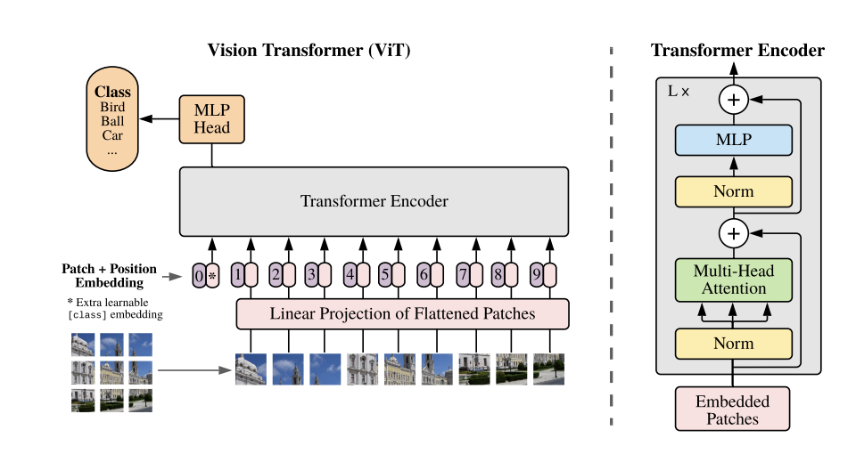
  <br>
  <em>Vision Transformer architecture: Image patches are processed through self-attention layers for global context understanding.</em>
</p>

<p align="center">
  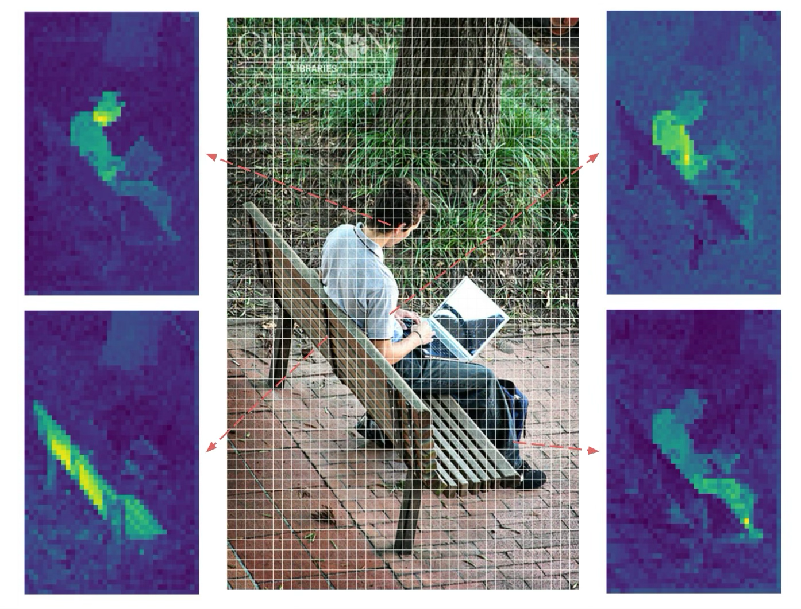
  <br>
  <em>Emergent segmentation in DINOv2: Affinity maps show how the model naturally groups pixels into semantically coherent objects.</em>
</p>

### 2. Semantic Painting with SPADE

The **"semantic painting"** technique addresses a specific challenge: how to inject unsupervised segmentation information when segment IDs lack semantic coherence across images.

#### The Challenge

Standard approaches use learned embeddings for segment IDs (e.g., segment #5 → feature vector). But with unsupervised segmentation:
- Segment #5 in image A might be a **face** (high saliency)
- Segment #5 in image B might be a **tire** (low saliency)
- This **semantic incoherence** makes learned embeddings fail

#### The Solution: Semantic Painting

Instead of learning fixed embeddings, we create a **dynamic, feature-rich guidance map** for each image:

1. Extract deep features from DINOv2 for each image patch
2. For each segment, compute its **prototype vector** by averaging the features of all patches within that segment
3. Create a dense map where each pixel's value is the prototype vector of its segment
4. Use this rich semantic map to modulate network activations via **SPADE (Spatially-Adaptive Normalization)**

<p align="center">
  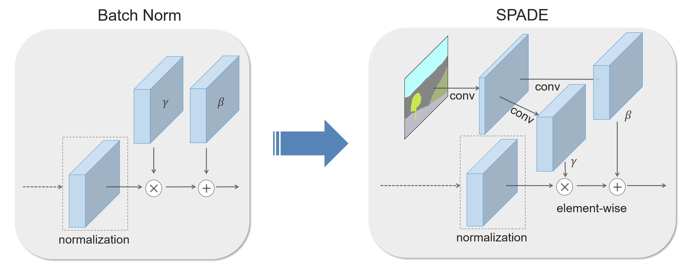
  <br>
  <em>SPADE mechanism: The segmentation map generates spatial modulation parameters (γ and β) that condition the network's feature processing.</em>
</p>

#### Segmentation Methods

We support multiple unsupervised segmentation approaches:

<p align="center">
  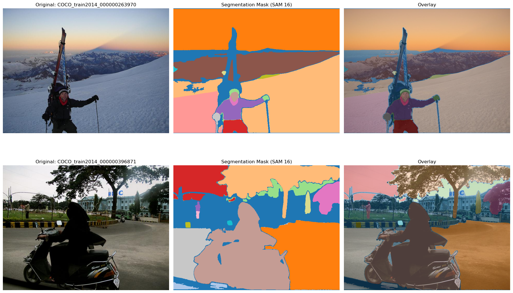
  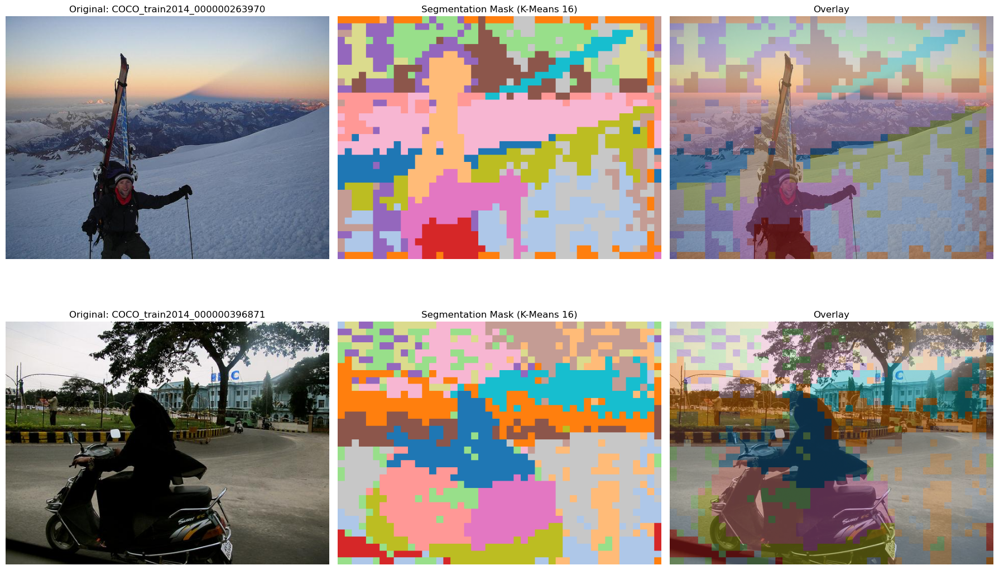
  <br>
  <em>Left: Segment Anything Model (SAM). Right: DINOv2 features + k-means clustering.</em>
</p>

### 3. Multi-Stage Training Pipeline

Training follows a principled three-phase protocol designed to leverage each dataset's strengths:

```
Phase 1: SALICON Pre-training
   ↓  Learn general spatial saliency from 10,000+ images
   ↓  Train: Spatial priority network
   ↓
Phase 2: MIT1003 Spatial Fine-tuning
   ↓  Adapt to high-fidelity eye-tracking data
   ↓  Train: Spatial priority network (continued)
   ↓
Phase 3: MIT1003 Scanpath Training
   ↓  Learn temporal dynamics of sequential viewing
   ↓  Train: Scanpath and fixation selection networks
   ↓  Freeze: Spatial priority network
```

This "Load-then-Freeze" strategy ensures optimal use of both large-scale pseudofixation data and smaller but higher-quality true scanpath data.

---

## Results

### Quantitative Performance

DinoGaze-SPADE and the DinoGaze ViT baseline establish strong task-specific gains across multiple metrics:

#### SALICON Spatial Saliency Benchmark

| Model | Log-Likelihood ↑ | Information Gain ↑ | NSS ↑ | AUC ↑ | IG Improvement |
|-------|------------------|-------------------|-------|-------|----------------|
| DeepGaze III (CNN) | 0.7642 | 0.3350 | 1.4036 | 0.7667 | -- |
| DinoGaze (ViT) | 0.8159 | 0.3867 | **1.6340** | **0.7727** | **+15.4%** |
| DinoGaze-SPADE (Final) | **0.8165** | **0.3873** | 1.6131 | 0.7726 | **+15.6%** |

#### MIT1003 Fine-tuning Task (10-fold cross-validation)

| Model | Log-Likelihood ↑ | Information Gain ↑ | NSS ↑ | AUC ↑ | IG Improvement |
|-------|------------------|-------------------|-------|-------|----------------|
| DeepGaze III (CNN) | 2.0572 ± 0.0721 | 1.1511 ± 0.0437 | 6.9074 ± 0.7291 | 0.8974 ± 0.0049 | -- |
| DinoGaze (ViT) | **2.2038 ± 0.0704** | **1.2981 ± 0.0405** | **8.0406 ± 0.8457** | **0.9050 ± 0.0044** | **+12.8%** |
| DinoGaze-SPADE (Final) | 2.1938 ± 0.0748 | 1.2881 ± 0.0392 | 8.0211 ± 0.8328 | 0.9047 ± 0.0046 | **+11.9%** |

### What the Results Tell Us

1. **ViT Backbone is Superior**: Simply replacing the CNN with a Vision Transformer (DinoGaze) dramatically improves performance
2. **Explicit Segmentation Helps**: Adding semantic painting (DinoGaze-SPADE) provides consistent additional gains, especially for scanpath prediction
3. **Semantic Understanding Matters**: The model learns to universally increase salience for semantically important regions (faces, text, etc.)

<p align="center">
  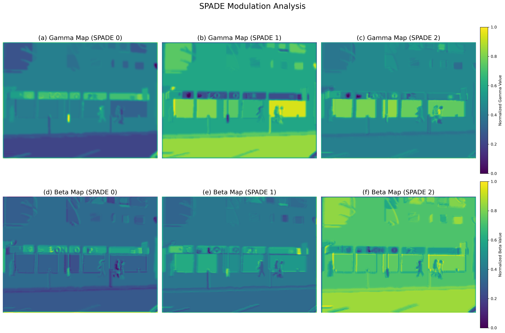
  <br>
  <em>γ and β modulation maps: The network learns segment-specific processing strategies (e.g., amplifying features for people and text).</em>
</p>

---

## Installation

### Prerequisites

- Linux (tested on Ubuntu)
- NVIDIA GPU with CUDA 11.8+
- [Pixi](https://pixi.sh/) package manager (recommended) or Conda

### Option 1: Using Pixi (Recommended)

Pixi handles all dependencies including CUDA-enabled PyTorch:

```bash
# Clone the repository
git clone https://github.com/MirkoMorello/Decoding_Neural_Dynamics_of_Visual_Perceptual_Segmentation.git
cd Decoding_Neural_Dynamics_of_Visual_Perceptual_Segmentation

# Run the setup task (installs everything)
pixi run setup
```

This single command will:
- Install all conda dependencies
- Install GPU-enabled PyTorch 2.6.0 with CUDA 11.8
- Install additional packages (xformers, torch-geometric, pysaliency)
- Register the Jupyter kernel

### Option 2: Manual Installation

```bash
# Create conda environment
conda create -n gaze-prediction python=3.11
conda activate gaze-prediction

# Install PyTorch with CUDA
pip install torch==2.6.0+cu118 torchvision==0.21.0+cu118 --index-url https://download.pytorch.org/whl/cu118

# Install other dependencies
# Install manually if you are not using Pixi.

# Install xformers
pip install xformers

# Install torch-geometric
pip install torch-scatter torch-sparse torch-cluster torch-spline-conv -f https://data.pyg.org/whl/torch-2.6.0+cu118.html

# Install development version of pysaliency
pip install git+https://github.com/matthias-k/pysaliency.git@dev
```

### Verify Installation

```bash
# Test PyTorch and CUDA
python -c "import torch; print(f'PyTorch: {torch.__version__}'); print(f'CUDA available: {torch.cuda.is_available()}')"

# Test xformers
python -c "import xformers; print(f'xformers: {xformers.__version__}')"
```

---

## Usage

### Training the Full Pipeline

The main training orchestrator manages the complete three-phase training protocol:

```bash
# Single GPU
pixi run python -m src.orchestrator --master-config configs/v2/pipeline.yaml --nproc_per_node=1

# Multi-GPU (e.g., 2 GPUs)
pixi run python -m src.orchestrator --master-config configs/v2/pipeline.yaml --nproc_per_node=2
```

The `pipeline.yaml` file defines the complete training sequence. The orchestrator automatically:
- Runs each training phase in order
- Passes checkpoints between stages
- Handles cross-validation folds for MIT1003
- Manages distributed training setup

### Training Individual Models

To train a specific model variant:

```bash
# Train DinoGaze (ViT baseline) on SALICON
pixi run python -m src.train --config configs/v2/dinogaze_salicon.yaml

# Train DinoGaze-SPADE with SAM-64 segmentation
pixi run python -m src.train --config configs/v2/dinogazev1_sam64_salicon.yaml

# Fine-tune on MIT1003
pixi run python -m src.train --config configs/v2/dinogaze_spatial.yaml --fold 0

# Train scanpath model (with frozen spatial network)
pixi run python -m src.train --config configs/v2/dinogaze_scanpath_frozen.yaml --fold 0 --resume_ckpt path/to/spatial_checkpoint.pt
```

### Exploring Results with Notebooks

The `notebooks/` directory contains Jupyter notebooks for analysis and visualization:

```bash
# Start Jupyter Lab
pixi run serve

# Then open:
# - visualizations.ipynb: Generate saliency maps and scanpath visualizations
# - performances.ipynb: Analyze model performance across metrics and folds
# - masks.ipynb: Explore segmentation mask generation
# - playground.ipynb: Interactive experimentation
```

---

## Project Structure

```
.
├── src/                          # Main source code
│   ├── models/                   # Model implementations
│   │   ├── dinogaze.py          # DinoGaze (ViT baseline)
│   │   ├── dinogaze_spade_v1.py # DinoGaze with learned ID embeddings (failed)
│   │   ├── dinogaze_spade_v2.py # DinoGaze with semantic painting (final)
│   │   ├── deepgaze.py          # DeepGaze III reproduction
│   │   └── common/
│   │       └── spade_layers.py  # SPADE implementation
│   ├── datasets/                 # Dataset loaders
│   │   ├── mit1003.py           # MIT1003 dataset
│   │   └── salicon.py           # SALICON dataset
│   ├── features/                 # Feature extractors (backbones)
│   │   ├── densenet.py          # DenseNet (for DeepGaze III)
│   │   └── ...                  # Other CNN backbones
│   ├── modules.py               # Core network modules
│   ├── layers.py                # Custom layers (attention, normalization)
│   ├── data.py                  # Data pipeline (LMDB, batching)
│   ├── training.py              # Training engine (DDP, AMP, metrics)
│   ├── orchestrator.py          # Multi-stage experiment orchestrator
│   ├── registry.py              # Model/dataset registry system
│   └── metrics.py               # Evaluation metrics (LL, IG, NSS, AUC)
│
├── configs/                      # Training configurations
│   └── v2/
│       ├── pipeline.yaml        # Master orchestration config
│       ├── dinogaze_*.yaml      # DinoGaze configs (all phases)
│       ├── dinogazev*_*.yaml    # DinoGaze-SPADE variants
│       └── deepgaze*.yaml       # DeepGaze III configs
│
├── notebooks/                    # Jupyter notebooks for analysis
│   ├── visualizations.ipynb     # Generate visualizations
│   ├── performances.ipynb       # Performance analysis
│   ├── masks.ipynb              # Segmentation mask exploration
│   └── playground.ipynb         # Experimentation
│
├── documents/                    # Thesis and papers
│   ├── Thesis/                  # Full thesis (LaTeX source)
│   │   ├── thesis.tex
│   │   ├── figs/                # All thesis figures
│   │   ├── chapter_*.inc.tex    # Thesis chapters
│   │   └── abstract.inc.tex
│   ├── Papers/                  # Reference papers
│   └── Slides/                  # Presentations
│
├── scripts/                      # Utility scripts
│
├── pixi.toml                    # Pixi environment specification
├── pixi.lock                    # Locked dependencies
└── README.md                    # This file
```

### Key Components

#### Models (`src/models/`)
- **dinogaze.py**: ViT-based baseline using frozen DINOv2 backbone
- **dinogaze_spade_v2.py**: Final model with semantic painting
- **deepgaze.py**: Reproduction of DeepGaze III for comparison

#### Data Pipeline (`src/data.py`, `src/datasets/`)
- **LMDB Caching**: Pre-processed datasets cached in memory-mapped database for blazing-fast reads
- **Shape-Aware Batching**: Custom sampler groups similar-sized images to minimize padding
- **On-the-Fly Augmentation**: Random crops, flips, and color jittering

#### Training Engine (`src/training.py`)
- **Distributed Data Parallel (DDP)**: Multi-GPU training support
- **Automatic Mixed Precision (AMP)**: Faster training with reduced memory
- **Gradient Accumulation**: Simulate large batch sizes
- **Comprehensive Logging**: TensorBoard integration

#### Orchestrator (`src/orchestrator.py`)
- Manages multi-stage training pipelines
- Handles checkpoint passing between stages
- Automates cross-validation loops
- Configurable via YAML

---

## Model Variants

This repository includes multiple model variants for ablation studies:

### Baseline Models
- **DeepGaze III**: Original CNN-based model (reproduction)
- **DinoGaze**: ViT-powered baseline (no segmentation)

### SPADE Models

The repository includes a progression of SPADE-based models that test different approaches to injecting segmentation information:

#### DeepGaze-SPADE v1 (CNN + Standard SPADE with Learned Embeddings)
Uses standard SPADE mechanism with learned, static embeddings for segment IDs. Results show minimal improvement (0.0% to 1.9% on MIT1003), confirming the semantic incoherence problem with unsupervised masks.

#### DeepGaze-SPADE v2 (CNN + Semantic Painting with DenseNet Features)
First implementation of semantic painting, using DenseNet's own features to create dynamic semantic maps. Shows modest but consistent improvement (~1.5% on MIT1003), providing proof-of-concept that semantic painting works.

#### DeepGaze-SPADE v3 (CNN + Semantic Painting with DINOv2 Features - Hybrid)
Hybrid model using DenseNet for saliency but DINOv2 features for semantic painting. Achieves substantial improvement (~7.5% on MIT1003), isolating the importance of high-quality semantic vocabulary.

#### DinoGaze-SPADE v1 (ViT + Semantic Painting — final model)
Final model combining a ViT backbone with semantic painting. Best overall performance: +15.6% on SALICON, +11.9% on MIT1003, and +6.5% on the scanpath prediction task.

### Segmentation Options
Each SPADE model supports multiple segmentation methods:
- `km16`: DINOv2 + k-means (16 segments)
- `sam16`: Segment Anything Model (16 segments)
- `sam64`: Segment Anything Model (64 segments)

Example: `dinogazev2_sam64` = DinoGaze-SPADE v2 with SAM-generated 64-segment masks

---

## Key Innovations Explained

### Why Vision Transformers?

**CNNs are fundamentally limited** for gaze prediction:

1. **Local Receptive Fields**: Each neuron sees only a small region. To understand a full object, information must pass through many layers.
2. **Feature Condensation**: Trained for classification, CNNs learn to discard spatial information in favor of semantic invariance.
3. **Hierarchical Bias**: They process scenes bottom-up (edges → textures → objects), not how humans perceive.

**Vision Transformers solve these issues**:

1. **Global Receptive Field**: Every patch attends to every other patch from layer 1. A face can directly "see" the object it's looking at.
2. **Emergent Segmentation**: Self-supervised training (DINOv2) naturally learns to group patches into objects without explicit supervision.
3. **Spatially Preserved**: ViTs maintain spatial structure throughout, perfect for dense prediction tasks like saliency.

### Why Semantic Painting Works

Traditional information injection methods fail with unsupervised segmentation because they assume **semantic coherence**: that segment #5 always means the same thing.

Semantic painting bypasses this by:
1. **Operating in feature space**: Each segment is represented by its average DINOv2 features (a 1024-dimensional vector)
2. **Creating a continuous vocabulary**: Instead of 64 discrete IDs, we have an infinite vocabulary in continuous feature space
3. **Preserving semantic relationships**: Segments with similar visual content (e.g., two different faces) naturally have similar prototype vectors

This allows the SPADE layers to learn meaningful modulations like:
- "Amplify features in regions that look like faces"
- "Suppress features in background-like regions"

Without needing to know in advance what "face" or "background" means!

---

## Evaluation Metrics

The models are evaluated using four standard metrics grounded in information theory:

### 1. Log-Likelihood (LL) - Primary Metric
**Higher is better** | Measured in bits

The average log probability density assigned by the model to actual human fixations. For a set of $N$ fixations $F = \{f_1, f_2, ..., f_N\}$:

$$\text{LL}(F | \text{model}) = \frac{1}{N} \sum_{i=1}^{N} \log_2 p(f_i | \text{context}_i)$$

where $\text{context}_i$ includes:
- **For spatial saliency**: just the image $I$
- **For scanpath prediction**: the image $I$ and the preceding fixation history $\{f_1, ..., f_{i-1}\}$

This is the most principled metric for probabilistic models. The base-2 logarithm means a difference of 1 bit indicates the better model finds human fixations twice as likely.

### 2. Information Gain (IG)
**Higher is better** | Measured in bits

The improvement in log-likelihood over a baseline model (center-bias Gaussian):

$$\text{IG} = \text{LL}(F | \text{model}) - \text{LL}(F | \text{baseline})$$

Quantifies how much additional information, in bits, the model provides about fixation locations beyond a simple default viewing strategy.

### 3. Normalized Scanpath Saliency (NSS)
**Higher is better** | Measured in standard deviations

For each fixation, the value of the model's predicted saliency map at that location after normalization to zero mean and unit standard deviation. The final score is the average over all test fixations.

### 4. Area Under ROC Curve (AUC)
**Higher is better** | Range: [0, 1]

Probability that the model assigns higher saliency to a randomly chosen fixated pixel than a randomly chosen non-fixated pixel. Treats saliency prediction as binary classification.

---

## Datasets

### MIT1003
- **Size**: 1,003 natural images
- **Observers**: 15 per image
- **Duration**: 3 seconds per image
- **Recording**: Eyelink II eye tracker (high precision)
- **Ground Truth**: Full scanpaths with timing
- **Aspect Ratio**: Variable (779 landscape, 228 portrait)
- **Resolution**: Longer dimension = 1024px
- **Use**: Fine-tuning and final evaluation (10-fold cross-validation)

### SALICON
- **Size**: 10,000 training + 5,000 validation images
- **Source**: Microsoft COCO dataset
- **Observers**: Crowdsourced via Amazon Mechanical Turk
- **Method**: Mouse-contingent blurred images (pseudofixations)
- **Aspect Ratio**: Fixed 4:3 (640×480)
- **Use**: Large-scale pre-training of spatial priority network

---

## Citation

If you use this code or build upon this work, please cite:

```bibtex
@mastersthesis{morello2025decoding,
  title={Decoding Neural Dynamics of Visual Perceptual Segmentation},
  author={Morello, Mirko},
  year={2025},
  school={University of Milan, University of Milan-Bicocca, and University of Pavia},
  type={Master's Thesis},
  note={Available at: https://github.com/MirkoMorello/Decoding_Neural_Dynamics_of_Visual_Perceptual_Segmentation}
}
```

### Related Papers

This work builds upon:

- **DeepGaze III**: Linardos et al. (2021) - *DeepGaze IIE: Calibrated prediction in and out-of-domain for state-of-the-art saliency modeling*
- **DINOv2**: Oquab et al. (2023) - *DINOv2: Learning Robust Visual Features without Supervision*
- **SPADE**: Park et al. (2019) - *Semantic Image Synthesis with Spatially-Adaptive Normalization*
- **Perceptual Segmentation**: Vacher et al. (2023) - *Measuring the Subjective Perception of Object Segmentation*

---

## Future Directions

This work opens several exciting research avenues:

### 1. Personalized Gaze Prediction
Replace generic unsupervised masks with **Perceptual Segmentation Maps (PSMs)** measured from individual observers. This would test the hypothesis: *knowing how a specific person sees the world allows us to predict where that person will look*.

### 2. Video and Dynamic Scenes
Extend the architecture to video, incorporating:
- Temporal segmentation consistency (object tracking)
- Motion cues and optical flow
- Attentional momentum and inhibition of return

### 3. Deeper Architectural Integration
- **Cross-attention**: Let scanpath history directly query segmented features
- **Object-aware transformers**: Explicit object representations as tokens
- **Hierarchical segmentation**: Multi-scale segment understanding

### 4. Clinical Applications
- **Medical imaging**: Guide radiologists' attention with learned saliency
- **Autism research**: Model atypical viewing patterns
- **Diagnostic tools**: Detect attentional abnormalities

---

## Acknowledgments

This thesis was completed as part of the Master of Science program in Artificial Intelligence for Science and Technology at the University of Pavia.

Special thanks to:
- The creators of DeepGaze III for establishing the probabilistic framework
- The DINOv2 team at Meta AI for their powerful self-supervised model
- The creators of the MIT1003 and SALICON datasets
- All contributors to the open-source libraries used in this project

---

## License

This project is licensed under the MIT License - see the [LICENSE](LICENSE) file for details.

---

## Contact

For questions, suggestions, or collaborations, please open an issue on GitHub or contact the author.

---

**Note**: This is a research implementation. For production use, additional optimization and engineering would be required. The code is provided as-is for academic and research purposes.

---

<p align="center">
  <em>Advancing the computational understanding of human visual attention through explicit structural reasoning</em>
</p>
